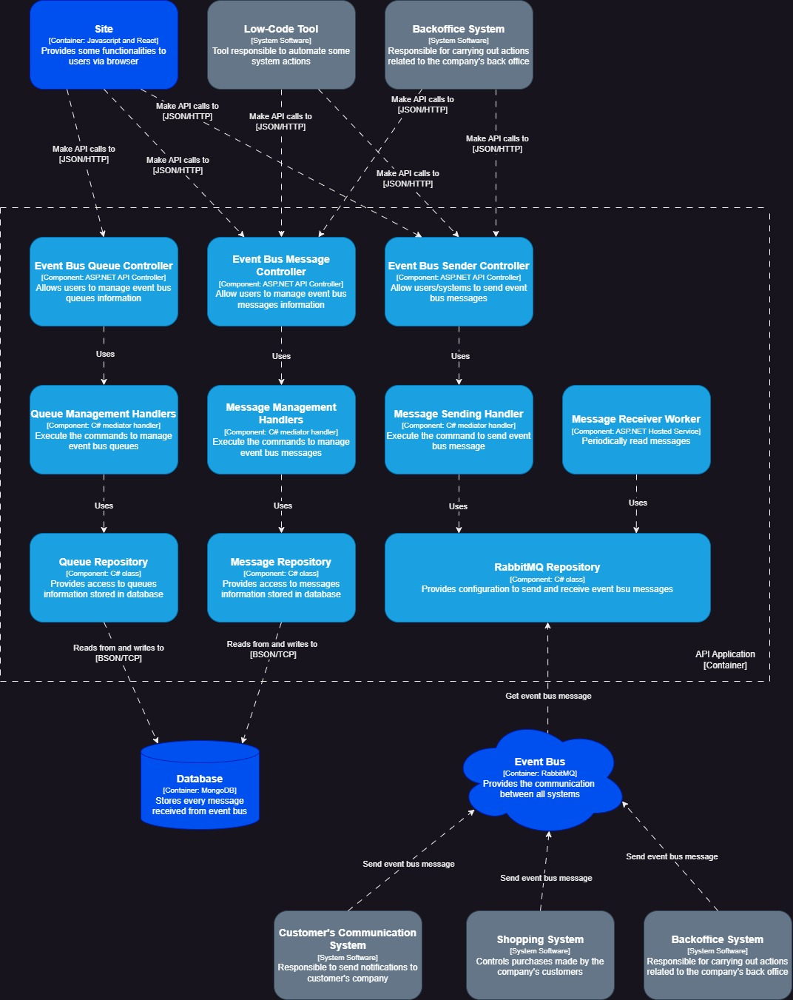

# Event Bus Inbox API

> ### Introdução

API criada em .NET 6 seguindo os princípios do DDD (Domain-Driven Design), responsável por armazenar toda a lógica de negócio do sistema de inbox de mensagens.

Sobre a estrutura arquitetural foi utilizado o princípio hexagonal, onde a figura central é a camada de domínio da aplicação, e todas as outras camadas se conectam à mesma.

Sobre os componentes do sistema, segue abaixo diagrama que exemplifica de forma simplificada.

Sobre banco de dados da aplicação, foi utilizado o MongoDB, com o intuíto de conseguir armazenar o conteúdo da mensagem recebida no formato JSON, auxiliando no consumo das mensagens em momento posterior.

Já sobre a mensageria utilizada, optei pelo RabbitMQ, a fim de estudar o seu funcionamento. Porém, da forma como a aplicação foi construída, pode ser facilmente adaptável para outro tipo de mensageria, como Kafka ou Azure Serivce Bus, por exemplo.

Sobre a leitura das mensagens recebidas no barramento, foi utilizado um "worker" (HostedService) para realizar tal ação. Seu funcionamento se dá da seguinte forma:

1. Executado a cada 1 minuto;
2. Obtém lista de filas habilitadas para leitura, através do repositório da mensageria;
3. Cria "threads" separadas para leitura em paralelo de cada fila;
4. Ao realizar leitura de uma mensagem recebida, aciona o "mediator" para comunicar ao sistema a recepção da mesma;
5. O manipulador de mensagens realiza validação e, em caso positivo, persiste mensagem no banco de dados;
6. Caso o passo 5 tenha retornado sucesso, completa a mensagem.

Sobre a concepção do "worker", o mesmo pode ser facilmente substituído por uma aplicação "adapter", responsável somente por realizar a leitura das mensagens, como por exemplo uma Azure Function.

> ### Design Pattern aplicados

Sobre os design pattern aplicados na construção do sistema, destaco os seguintes:

- **Singleton:** utilizado na criação da classe de leitura de configurações do ambiente, para que o mesmo fosse criado somente uma vez na aplicação, e pudesse ser utilizado em vários pontos da mesma;
- **Factory:** utilizado na criação da sumarização das mensagens vinculadas às filas criadas pelo usuário;
- **Command:** utilizado na execução dos manipuladores de ações do sistema, para encapsular os dados das requisições;
- **Mediator:"" utilizado juntamente com a biblioteca "MediatR" para acalçar o desacoplamento das camadas do sistema, além de centralizar a comunicação entre os mesmos;
- **State:** utilizado no gerenciamento dos estados das filas e das mensagens.

> ### Bibliotecas utilizadas

- **Asp.Versioning.Mvc 6.4.1:** utilizado para realizar o versionamento da API;
- **Asp.Versioning.Mvc.ApiExplorer 6.4.0:**: utilizado para realizar o versionamento da API;
- **AutoMapper 13.0.1:** utilizado para realizar o mapeamento entre entidades, modelos, requisições e respostas da aplicação;
- **MediatR 12.2.0:** utilizado para realizar a comunicação interna da aplicação de forma simplificada, procurando desacoplar as camadas;
- **FluentValidation 11.9.0:**: utilizado para realizar validações nos dados das requisições recebidas;
- **MongoDB.Driver 2.24.0:** utilizado na comunicação com o banco de dados da aplicação;
- **RabbitMQ.Client 6.8.1:** utilizado na comunicação com a mensageria do sistema;
- **Serilog 3.1.1:** utilizado na geração de logs do sistema;
- **Serilog.AspNetCore 8.0.1:** utilizado na geração de logs do sistema;
- **Serilog.Sinks.File 5.0.0:** utilizado na geração de logs do sistema;
- **Serilog.Sinks.MongoDB 5.4.:** utilizado para persistir os logs do sistema no banco de dados;
- **Swashbuckle.AspNetCore 6.5.0:** utilizado para documentar a API;
- **Swashbuckle.AspNetcore.Annotations 6.5.0:** utilizado para documentar a API;
- **xunit 2.4.2:** utilizado para realizar os testes unitários da aplicação;
- **Bogus 35.4.0:** utilizado para gerar dados "fake" utilizados nos testes unitários;
- **Moq 4.20.70:** utilizado para gerar "instâncias" fake dos repositórios da aplicação nos testes unitários.

> ### Funcionalidades

Sobre funcionalidades relacionadas às filas utilizadas pela mensageria, segue lista abaixo.

- Consulta de dados de uma fila do sistema;
- Listagem paginada de filas do sistema, com possibilidade de utilização de filtros;
- Inclusão/Alteração dos dados de uma fila;
- Alteração do estado (status) de uma fila (permitindo desligar/ligar a leitura de mensagens dessa fila);
- Exclusão de fila registrada.

Sobre as funcionalidades relacionadas às mensagens recebidas da mensageria, segue lista abaixo.

- Consulta de dados de uma mensagem;
- Listagem pagina de mensagens de filas, com possibilidade de utilização de filtros;
- Envio de mensagem para uma fila específica;
- Alteração dos dados de uma mensagem recebida;
- Exclusão de mensagem recebida;
- Reativação de mensagem para reprocessamento (alteração do status da mesma para aguardando processamento);
- Listagem de mensagens disponíveis para processamento de uma determinada fila;
- Atualização do status de uma mensagem recebida (registro do processamento realizado por outro sistema).