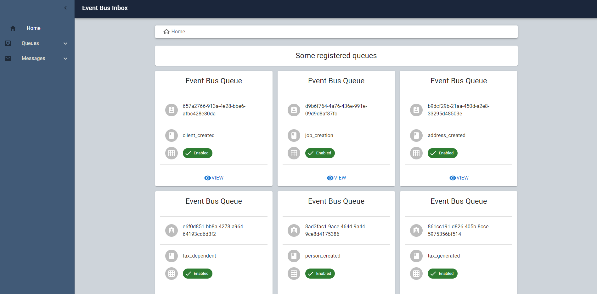
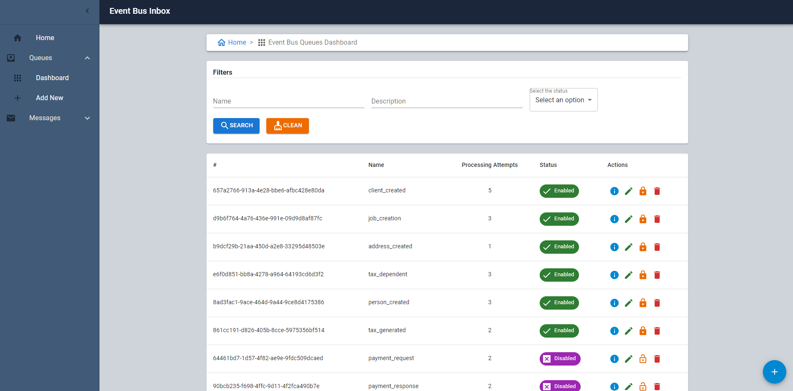
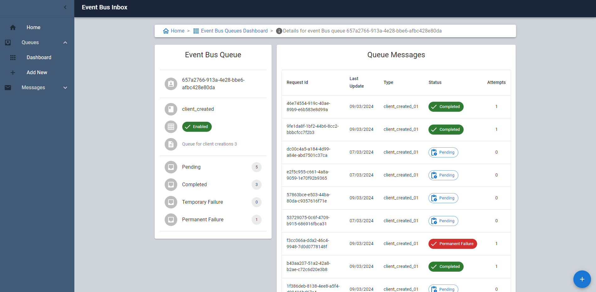
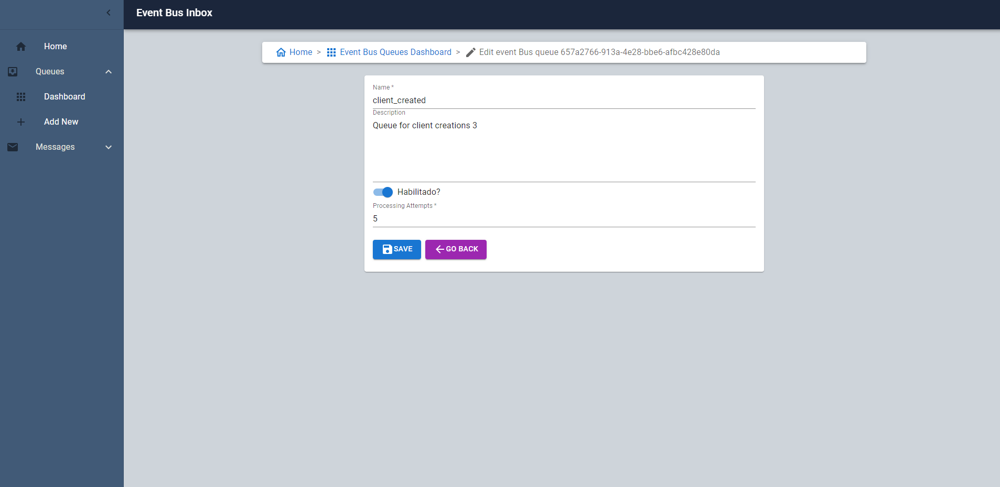
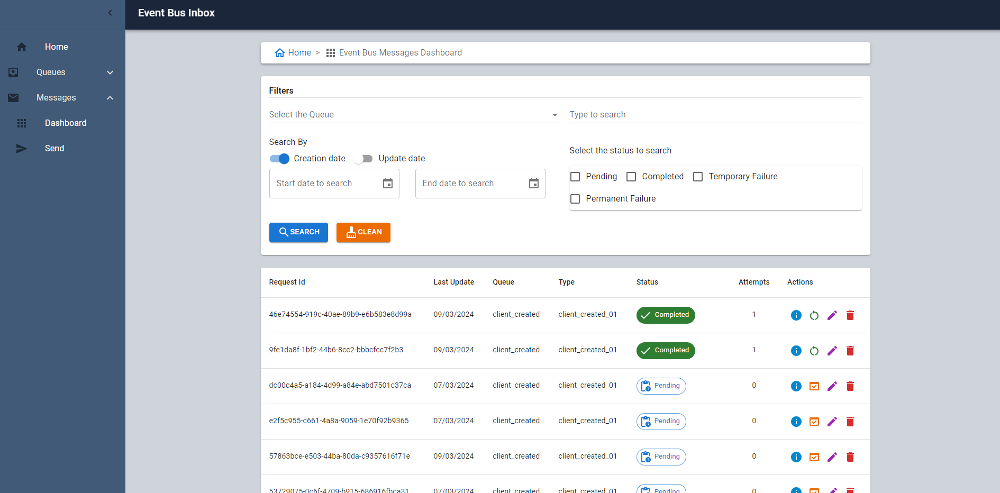
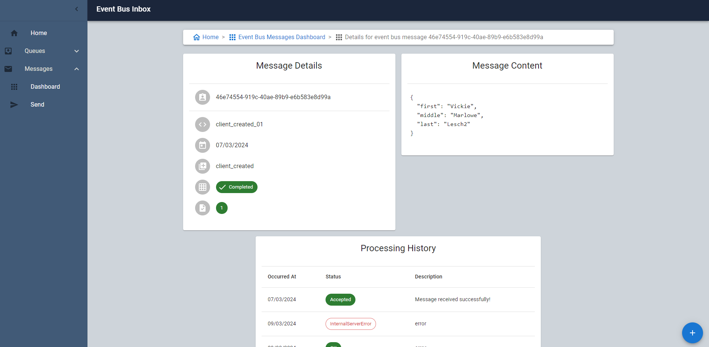
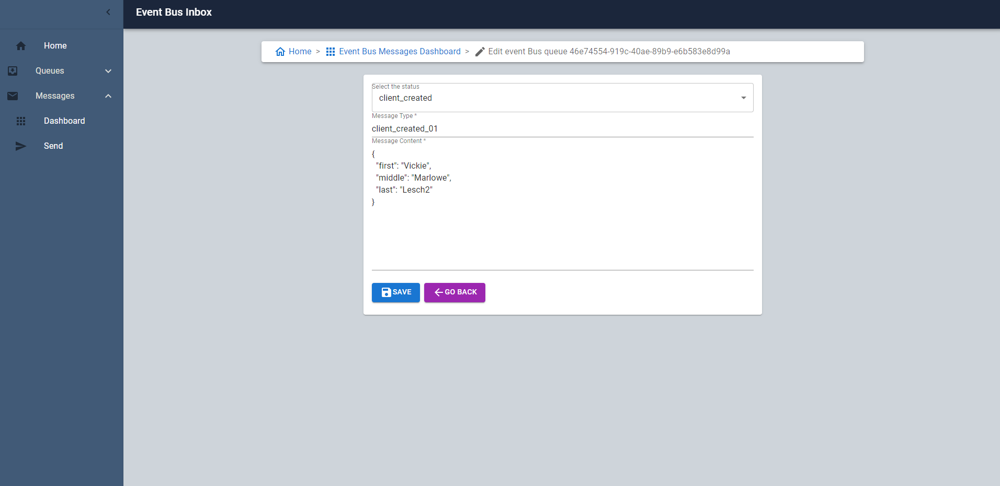

# Event Bus Inbox Site

> ### Introdução

Front-End do sistema de inbox do barramento de eventos, foi construído em React, utilizando o ["Create React App"](https://github.com/facebook/create-react-app).

Sobre o layout da aplicação, foi utilizado o ["Material UI"](https://mui.com);

Dentre as funcionalidades da aplicação, estão a possibilidade de inclusão/alteração de filas, bem como alteração do seu estado, listagem de mensagens recebidas nas filas, alteração do estado dessas mensagens, bem como o envio de novas mensagens.

Para saber mais sobre o contexto da aplicação, ["acesse aqui."](https://github.com/GustavoAraujo26/eventbus-inbox/tree/master)

> ### Execução

Para executar a aplicação, após clonar o repositório para sua máquina, realize os passos abaixo, utilizando o prompt de comando (caso esteja em ambiente Windows, sugiro utilizar o Powershell, além de executá-lo em modo administrador).

1. Instalação dos pacotes e dependências:

Antes de executar o site, realize a instalação das dependências do mesmo através do comando abaixo na raiz do site ["./Site"](https://github.com/GustavoAraujo26/eventbus-inbox/tree/master/Site).

``
npm install
``

2. Execução do sistema:

Após baixadas e instaladas todas as dependências da aplicação, execute o comando abaixo.

``
npm start
``

> ### Bibliotecas utilizadas

Segue listagem das bibliotecas utilizadas pela aplicação.

- **react-router-dom 6.22.1:** utilizado para configurar as rotas (navegação) da aplicação;
- **react-redux 9.1.0:** utilizado na configuração do gerenciamento de estados da aplicação;
- **@reduxjs/toolkit 2.2.1:** utilizado na configuração do gerenciamento de estados da aplicação;
- **@types/react-redux 7.1.33:** utilizado na configuração do gerenciamento de estados da aplicação;
- **uuid 9.0.1:**: utilizado para geração de identificadores únicos para serem enviados para a API;
- **axios 1.6.7:**: utilizado para realização de chamadas HTTP REST para a API;
- **@mui/material 5.15.11:**: utilizado na construção do layout da aplicação;
- **@mui/icons-material 5.15.11:** utilizado na construção do layout da aplicação;
- **@mui/x-date-pickers 6.19.6:** utilizado na criação de campos de seleção de datas nas telas de cadastro/pesquisa da aplicação;
- **@fontsource/roboto 5.0.8:** utilizado na construção do layout da aplicação;
- **dayjs 1.11.0:** utilizado na criação de campos de seleção de datas nas telas de cadastro/pesquisa da aplicação;

> ### Exemplos do sistema

Sobre o layout e funcionalidades do sistema, abaixo seguem algumas imagens para exemplificar os mesmos.

- **Página inicial**

- **Listagem de filas**

- **Detalhes de uma fila**

- **Formulário de fila**

- **Listagem de mensagens recebidas**

- **Detalhes de mensagem recebida**

- **Formulário de envio/edição de mensagem**

